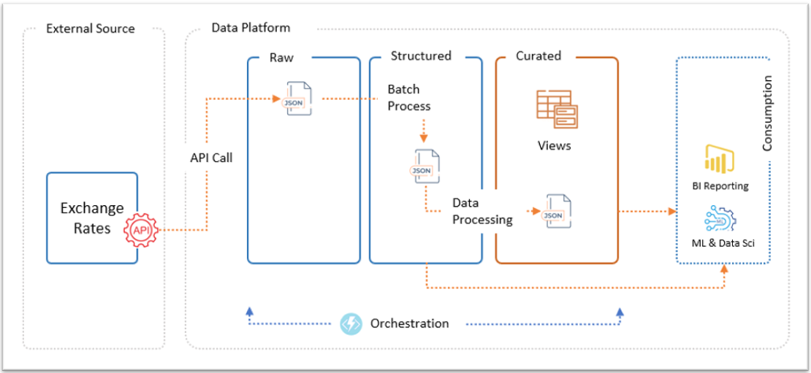
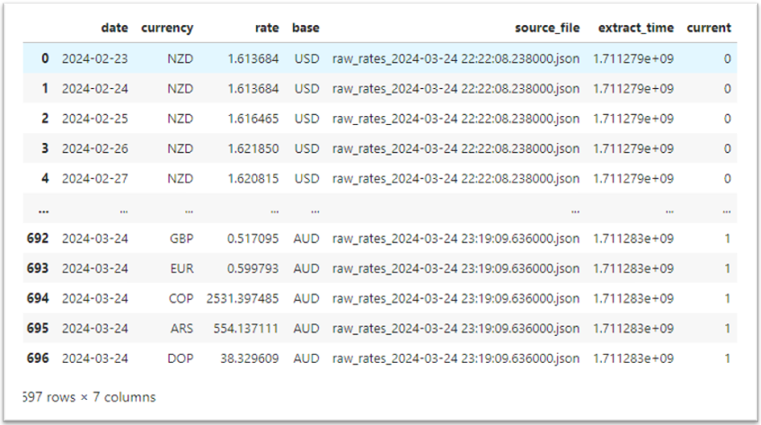

# Application's Architecture

In addressing the requirements outlined in this challenge, I've opted to employ a medallion architecture approach. Although the current solution is a preliminary rendition of this framework, featuring Raw, Structured, and Curated layers, it provides a structured methodology for managing data organization, transformation, and utilization. This approach prioritizes incremental improvements, adaptability, and governance, facilitating the exploration of advanced analytics and machine learning applications.

Here is a high-level architectural diagram illustrating the data flow journey, starting from API ingestion, progressing through the Raw, Structured, and ultimately Curated layers, before finally serving the data to downstream ML and Data Science teams.

### Considerations

Given the tight deadline and other commitments, I opted for a simplified approach in developing this solution. While I would have preferred to implement a more robust solution given more time, I'd like to highlight some considerations I took into account during the development process:

- The code includes an actual ```API``` call using an active access key, which expires on ```Saturday 20 April, 2024```.
- In the interest of time, a conscious decision was made not to implement a metadata-driven approach for ingestion as initially planned.
- In structured layer, I took a crude ```SCD2``` approach, incorporating only a ```current``` column without the ```from``` and ```to``` columns as intended.
- In favor of simplicity, I've decided to save all files in ```.json``` format instead of converting them to ```.parquet```.
- Time permitting, my plan is to extend the unit-case coverage to as much as the code as possible. Currently I have implemented only a few test cases.

Despite these limitations, I believe the solution effectively addresses the core requirements.

### Target State Architecture


#### Raw Layer
The Raw layer serves as a repository for storing data in its original format with minimal alterations. This ensures the accurate preservation of data lineage, enabling us to reconstruct higher layers in the event of a major failure.

In the code, I establish a connection to the API endpoint and retrieve the most recent data in JSON format. Upon obtaining the data, I augment it with two metadata attributes: `extract_time`, indicating the timestamp of the data extraction, and `source`, denoting the origin of the data, before writing this enriched JSON object into the raw layer. 

With each API call, a new JSON file is generated following the naming convention `raw_rates_{current_timestamp}.json`, where `{current_timestamp}` represents the timestamp of the current data extraction. This approach ensures that each dataset is uniquely identified and timestamped, facilitating traceability and versioning within the data pipeline.


#### Structured Layer
In the implemented code, the latest JSON file residing in the Raw layer is read to extract the exchange rates data. Subsequently, this data undergoes a series of transformations, including cleaning and de-duplication as required and are stored in the Structured layer with schema enforced on the dataset to ensure data quality.

To enhance traceability, two metadata columns, namely `source_file` and `extract_time`, facilitating the tracking of data sources and extraction times. Utilizing a Slowly Changing Dimension (SCD2) approach, an additional column `current` is introduced to delineate the current records.




#### Curated Layer
Finally the Curated layer is built upon the Structured layer. This layer represents a refined version of the data where aggregations and further refinements are applied to tailor it for specific use cases.  

Typically, the data from this layer is served to Business Intelligence (BI) systems for in-depth analysis and reporting purposes.


#### Orchestration
For this challenge, a straightforward orchestration mechanism has been devised. It revolves around batch ingestion, facilitated by a sequence of function calls. These functions seamlessly fetch data from the API endpoint and transition it through the Raw, Structured, and ultimately Curated layers.

#### Disaster Recovery
In case of a catastrophe affecting data integrity or loss within the Structured or Curated layers, recovery is possible by reconstructing these layers using the Raw layer's contents, provided the Raw layer remains unaffected.
