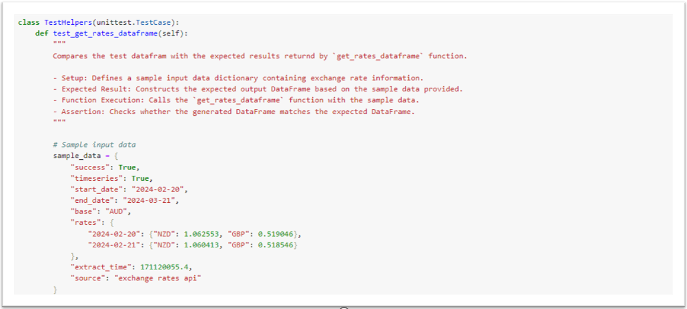
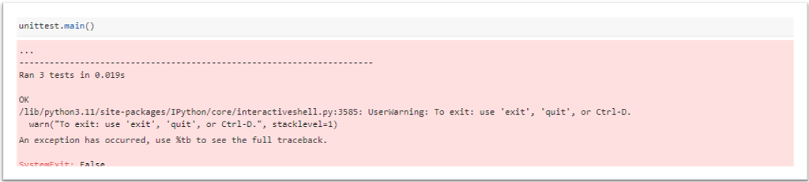

# Automated & Manual Test Cases

I've outlined an initial set of test cases for the ```helpers.ipynb``` module, but it's important to note that they're not yet exhaustive. Moving forward, my plan is to expand the test coverage by developing additional automated test scripts as time permits.

Additionally, I'll provide documentation for manual testing scenarios that can be explored in the near future.

### Automated Unit Tests

As mentioned above there some unit tests available for the ```helpers.ipynb``` module. They can be found in the ```/tests/``` folder and you can run them by clicking on the ```Run``` button from the menu at the top.




