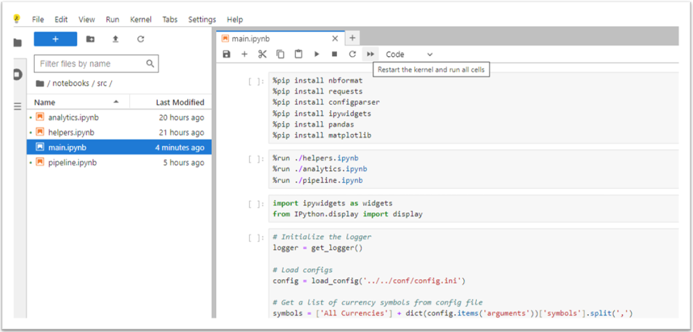
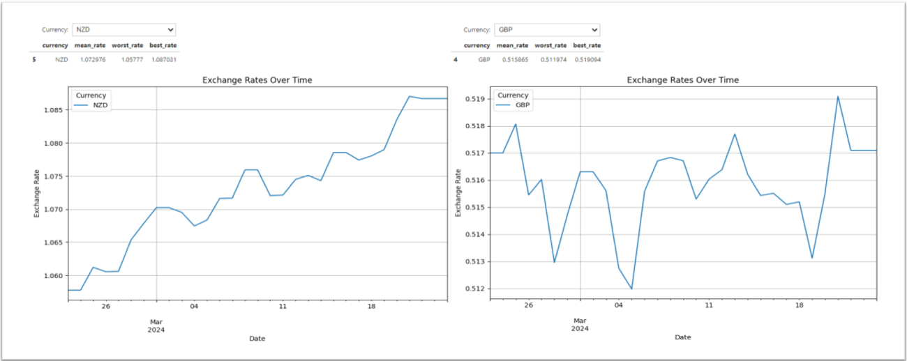
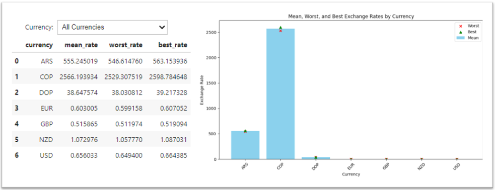
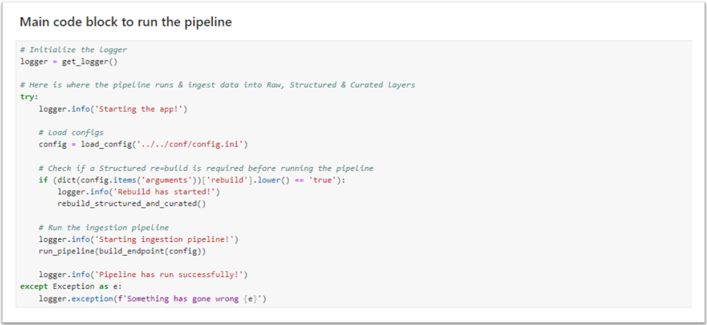

# User's Guide

### Introduction

This application was developed as part of a technical interview process during a recruitment drive. It serves as a comprehensive tool for curating exchange rates data from various API endpoints and delivering it to users for analytical purposes. The primary objectives of the development process were to fulfill the following requirements:

- Establish connectivity to any exchange rates API to retrieve data reflecting the exchange rates between Australia and New Zealand over the past 30 days, formatting it into JSON output.
- Implement preprocessing measures to address any anticipated data issues and ensure data quality.
- Conduct thorough data analysis, including identifying the best and worst exchange rates recorded within the specified time period, and calculating the average exchange rate for the month.

Additionally, the application incorporates a basic medallion architecture pattern and pipeline structure to enhance its coherence and efficiency.

### Getting Started

#### Environment Setup

The application has been developed using [JupyterLite](https://jupyter.org/try), with all source and test files stored in ```.ipynb``` format. To utilize the application, it is necessary to clone this repository into Jupyter or any other compatible platform.

Please ensure that all folders, except for the ```docs``` folder, are present in your environment for the application to function properly. You can access the comprehensive folder structure of the application in the [Appendix](#appendix) section of this document.

Once the setup is complete, navigate to the ```main.ipynb``` notebook and execute it. This process retrieves data from the API, organizes it into ```Raw```, ```Structured``` & ```Curated``` layers, and generates a statistical table and two charts.

The statistical table and one of the charts offer interactive features, allowing users to select specific currencies for filtering purposes.

#### Configuration Settings

The application does not directly accept user-supplied parameters. However, users have the option to customize specific attributes by editing the provided config.ini file. 

While this file includes default values, a comprehensive description and a list of allowed values for each attribute can be found in the [Appendix](#appendix) section of this document. Below are the default values provided with this application.

```
[arguments]
endpoint=https://api.exchangeratesapi.io/v1/timeseries
access_key=26e5547f91c8fd04634605e604ce5835
date_threshold=30
base_currency=AUD
symbols=NZD,USD,GBP,EUR,COP,ARS,DOP
```

### Using the Application

Once the app setup is complete, navigate to the ```main.ipynb``` notebook and select ```Restart the Kernel and run all cells``` from the quick menu items.



This will initiate the kernel and execute all cells sequentially. Initially, the notebook installs some prerequisite Python packages, imports necessary modules, and then runs the pipeline to populate data into Raw, Structued & Curated layers.

Upon data availability, it generates a summary table and a chart displaying exchange rates over time. Both the table and the chart are interactive, allowing users to filter the data using widgets on the screen.



Additionally, it will generate a summary exchange chart for each currency, displaying the mean, best, and worst exchange rates on a bar chart.



#### Updating Configuration or Getting New Sets of Data

If you have updated the ```config.ini``` file (e.g. to change your base currency from AUD to USD), you will need to rerun the code block below to load the config into memory. This is also true, if you just want to obtain a new set of data from the API.

The API will serve new sets of exchange rates data every 10 minutee.



### Error Handeling

Error handling is implemented using ```try: except:``` blocks, and all logs are written to two distinct locations.

The application utilizes a logger with two handlers: one writes to the console, and the other to a log file. By default, the log level for the console handler is set to ```WARNING```, while for the file handler, it is set to ```DEBUG```.

Users can modify these settings in the ```conf/logging.conf``` file.

### Appendix

#### Config.ini - Default & Allowed Values

| Key | Description | Default Value | Allowed Values |
|----------|----------|----------|----------|
|endpoint | URL to API's endpoint | https://api.exchangeratesapi.io/v1/timeseries |N/A|
|access_key | Key to authenticate with the API | 26e5547f91c8fd04634605e604ce5835 |N/A|
|date_threshold | Number of days we can go back | 30 |0 >= x <=365|
|base_currency | A single currency code | AUD |Consult list of [currencies](#currency-codes) below|
|symbols | Comma seperated list of currencies | NZD,USD,GBP,EUR,COP,ARS,DOP |Consult list of [currencies](#currency-codes) below|

#### Currency Codes

You can access a full list of all valid currency codes in [IBAN](https://www.iban.com/currency-codes) website.


#### Folder Structure

```
exchangerates/
├── conf/
│   ├── config.ini
|   └── logging.conf
|
|── data/
|   ├── curated/
|   |   └── summary_rates.json
|   |
|   │── raw/
|   │   ├── raw_rates_2024-03-23 23_28_59.799000.json
|   │   ├── raw_rates_2024-03-23 23_29_45.542000.json
|   |   └── ...
|   |
│   └── structured/
|       └── structured_rates.json
|
|── docs/
|    ├── architecture.md
|    ├── user_guide.md
|    └── test_cases.md
|
|── logs/
|   └── exchangerates.log
|
|── notebooks/
|   │── src/
|   │   │── analytics.ipynb
|   │   │── helpers.ipynb
|   │   │── main.ipynb
|   │   └── pipeline.ipynb
|   |
|   └── tests/
|       └── test_helpers.py
|
├── LICENSE
└── README.md
 
```
